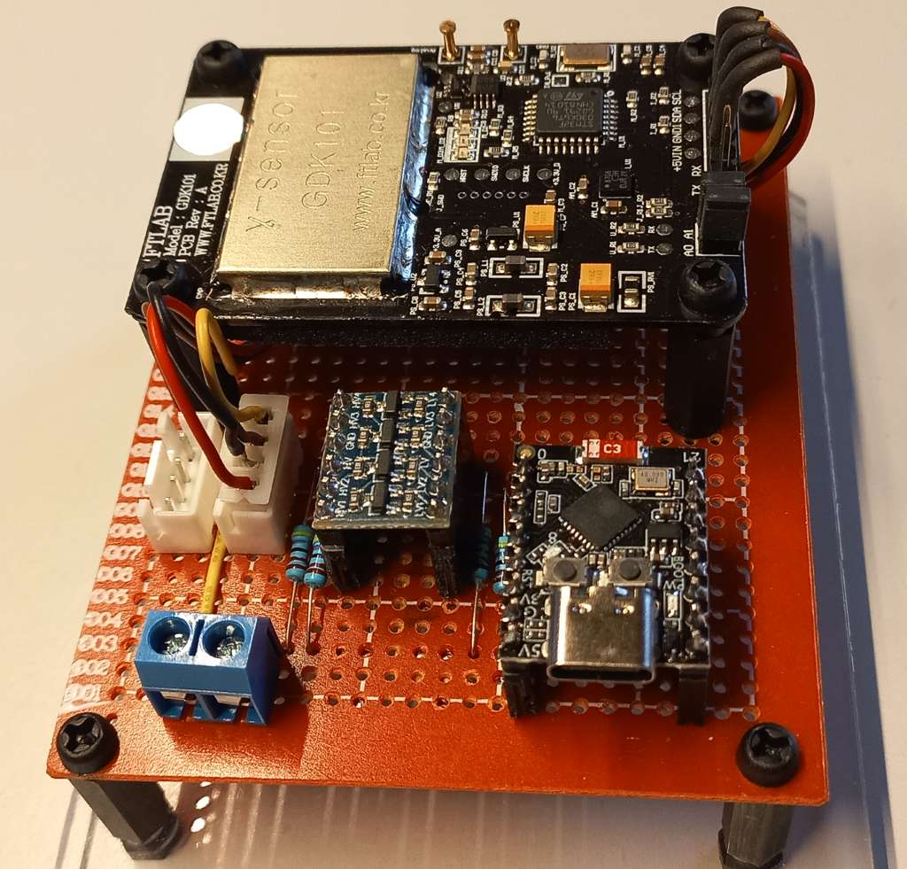

# ESPHome Gamma Radiation Detector (GDK101 rev:A)

Custom ESP32-based gamma radiation detector integrated into Home Assistant using ESPHome.

This project combines custom hardware integration, I²C signal handling, firmware adjustments and Home Assistant visualization into a structured embedded systems solution.

---

## Project Motivation

The goal of this project was to build a reliable, low-drift gamma radiation monitoring device for long-term stationary operation and integration into an existing Home Assistant infrastructure.

Unlike traditional Geiger-Müller tube based designs requiring high-voltage modules and periodic calibration, the selected GDK101 rev:A solid-state sensor provides:

- Factory calibration
- Low drift characteristics
- Mechanical robustness
- Digital I²C interface
- No high-voltage circuitry required

---

## Hardware Architecture

**Core Components:**

- ESP32-C3 Mini Dev Board (3.3V logic)
- GDK101 rev:A Gamma Radiation Sensor (5V I²C)
- Bidirectional I²C Level Shifter (3.3V ↔ 5V)

### Design Considerations

- Voltage level mismatch between ESP32 (3.3V) and GDK101 (5V) required I²C level shifting
- Stable 5V power supply for sensor operation
- Noise isolation and signal integrity on I²C bus
- Compact and robust PCB layout

*Hardware prototype on perfboard*

---

## Firmware Architecture (ESPHome)

The sensor is integrated using ESPHome over I²C.

## Engineering Challenge: Slow I²C Initialization (GDK101 rev:A)

The GDK101 **rev:A** requires an extended startup time after power-up before stable I²C communication is possible.  
Default ESPHome initialization accessed the device too early, causing I²C timeouts and aborted initialization.

**Fix:** A custom ESPHome `external_components` integration was implemented with:

- explicit initialization state (`initialized_`)
- background retries every 2 seconds
- bounded retry window (45 attempts ≈ 90 seconds)
- no permanent component failure during boot

See: `docs/esphome-integration-modification.md`

---

## Home Assistant Integration

- Radiation data exposed as sensor entity
- Real-time measurement values
- Long-term statistics via HA recorder
- Visualization via dashboard components

---

## Key Engineering Decisions

| Decision | Rationale |
|----------|-----------|
| GDK101 rev:A | Stable, factory calibrated, no HV required |
| ESP32-C3 | Low power, sufficient I²C performance |
| Level shifter | Safe voltage translation |
| ESPHome | Rapid integration into HA ecosystem |
| Custom initialization patch | Required for hardware-specific timing behavior |

---

## Current Status

- Hardware revision: v1.0
- PCB designed and validated
- ESPHome integration stable
- Home Assistant visualization operational
- Long-term stability testing ongoing

---

## Future Improvements

- Extended data logging and anomaly detection
- Environmental correlation (temperature influence)
- Optional MQTT standalone mode
- Enclosure design refinement
