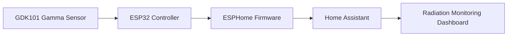

# ESPHome Gamma Radiation Detector (GDK101 rev:A)

Custom ESP32-based gamma radiation detector integrated into Home Assistant using ESPHome.

This project combines custom hardware integration, I²C signal handling, firmware adjustments and Home Assistant visualization into a structured embedded systems solution.

---

# Overview

This project implements a compact gamma radiation monitoring system based on the **GDK101 rev:A solid-state radiation sensor** and an **ESP32-C3 controller**.

The system continuously measures radiation levels and integrates the data into **Home Assistant**, enabling real-time monitoring and long-term statistics.

Unlike traditional Geiger-Müller tube designs, this system avoids high-voltage circuitry and calibration drift by using a factory-calibrated digital radiation sensor.

---

# Motivation

The goal of this project was to build a reliable gamma radiation monitoring device suitable for **long-term stationary operation**.

Typical requirements included:

- stable long-term measurements
- reliable sensor initialization
- integration into an existing Home Assistant infrastructure
- compact and robust hardware

Compared to traditional Geiger-Müller based systems, the **GDK101 rev:A** provides several advantages:

- factory calibration
- low drift characteristics
- mechanical robustness
- digital I²C interface
- no high-voltage circuitry required

---

# Hardware Architecture

## Core Components

- ESP32-C3 Mini Dev Board (3.3V logic)
- GDK101 rev:A Gamma Radiation Sensor (5V I²C)
- Bidirectional I²C Level Shifter (3.3V ↔ 5V)

## Design Considerations

Several electrical and integration aspects had to be considered:

- voltage level mismatch between ESP32 (3.3V) and GDK101 (5V)
- stable 5V power supply for the sensor
- reliable I²C communication
- compact PCB layout suitable for enclosure integration

---

# System Overview



---

# Firmware Architecture (ESPHome)

The radiation sensor is integrated using **ESPHome over I²C**.

## Engineering Challenge: Slow I²C Initialization (GDK101 rev:A)

The **GDK101 rev:A** requires an extended startup time after power-up before stable I²C communication is possible.

Default ESPHome initialization accessed the device too early, resulting in:

- I²C timeouts
- failed component initialization

### Implemented Solution

A custom ESPHome `external_components` integration was implemented to handle the sensor startup behavior.

Key mechanisms:

- explicit initialization state (`initialized_`)
- retry-based initialization logic
- retry interval of 2 seconds
- bounded retry window (~90 seconds)
- prevention of permanent component failure during boot

Further technical details are documented in:

`docs/esphome-integration-modification.md`

---

# Home Assistant Integration

The sensor integrates directly into Home Assistant using ESPHome.

Provided functionality:

- radiation measurement exposed as sensor entity
- real-time monitoring
- long-term statistics using Home Assistant recorder
- dashboard visualization

---

# Documentation

Detailed project documentation is available in the `docs` directory.

- [Hardware Design](docs/hardware-design.md)
- [Firmware Architecture](docs/firmware-design.md)
- [ESPHome Integration Modifications](docs/esphome-integration-modification.md)
- [Lessons Learned](docs/lessons-learned.md)

---

# Repository Structure

```
docs/                 detailed project documentation
firmware/             ESPHome configuration
external_components/  custom ESPHome component for GDK101
images/               hardware and dashboard screenshots
```

---

# Key Engineering Decisions

| Decision | Rationale |
|--------|-----------|
| GDK101 rev:A | Factory calibrated radiation sensor |
| ESP32-C3 | Low power microcontroller with sufficient performance |
| I²C level shifter | Safe voltage translation between 3.3V and 5V |
| ESPHome | Rapid integration with Home Assistant |
| Custom initialization logic | Required due to sensor startup timing |

---

# Current Status

- Hardware revision: **v1.0**
- PCB designed and validated
- ESPHome integration stable
- Home Assistant visualization operational
- long-term stability testing ongoing

---

# Future Improvements

Potential future enhancements include:

- extended long-term data analysis
- environmental correlation (temperature influence)
- optional standalone MQTT mode
- enclosure refinement

---

# License

MIT License
